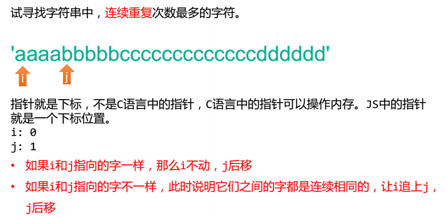
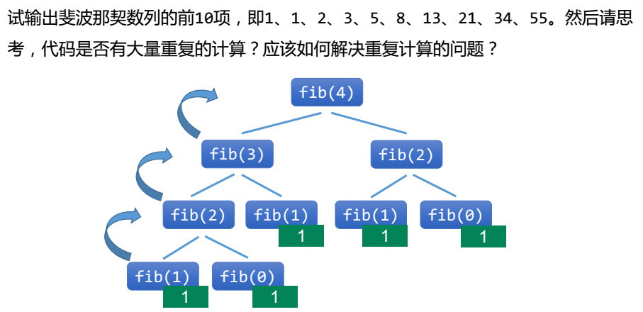
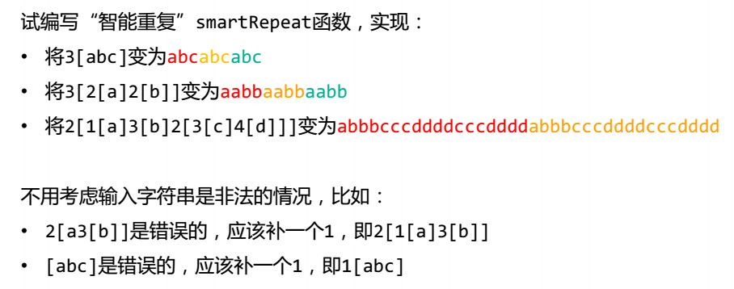
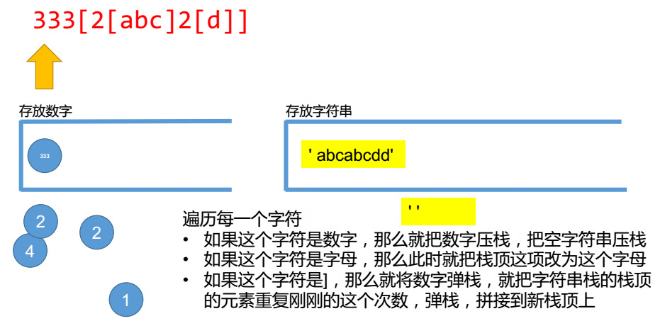
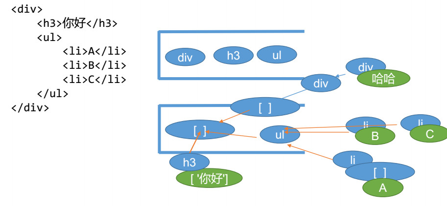

# AST抽象语法树

## 指针思想


## 递归思想


## 栈思想



## 思路
- 首先创建2个栈，stack1和stack2
- 遇见开始标签则将标签名推入到stack1，stack2推一个空对象
- 遇见文字则将文字push进stack2栈顶那一项
- 遇见结束标签，stack1直接弹出栈顶那一项，stack2也需要弹出栈顶那一项，但是还需要将弹出那一项push进当前stack2栈顶那一项


## parseHtml函数
```javascript
/**
 * @param {*} template html字符串
 * 解析html
 */
function parseHtml(template) {
    // 指针
    let index = 0;
    const stack1 = []
    // 这里初始化一个项是因为防止while循环吧最后一项给弹出来，导致stack2最后为空
    const stack2 = [{ children: [] }]
    let rest = ''
    // 开始标签，需要考虑表现上面的属性
    const startRegexp = /^\<([a-z]+[1-6]?)(\s[^\<]+)?\>/
    // 结束标签
    const endRegexp = /^\<\/([a-z]+[1-6]?)\>/
    // 文字
    const wordRegexp = /^([^\<]+)\<\/[a-z]+[1-6]?\>/
    while (index <= template.length - 1) {
        // 剩下的字符串
        rest = template.substring(index)
        if (startRegexp.test(rest)) {
            // 匹配开始标签
            const tag = rest.match(startRegexp)[1]
            // 标签上面的属性
            const attrsString = rest.match(startRegexp)[2]
            stack1.push(tag)
            stack2.push({ tag, children: [], attrs: parseAttrsString(attrsString) })
            const attrsStringLen = attrsString ? attrsString.length : 0
            // 指针跳转,<>占2位
            index += tag.length + 2 + attrsStringLen

        } else if (endRegexp.test(rest)) {
            // 匹配结束标签
            const tag = rest.match(endRegexp)[1]
            // </> 占三位
            index += tag.length + 3
            if (stack1[stack1.length - 1] === tag) {
                stack1.pop()
                // 弹出栈顶那一项
                const pop_tag = stack2.pop()
                if (stack2.length > 0) {
                    // 弹出项push进栈顶那一项
                    stack2[stack2.length - 1].children.push(pop_tag)
                }
            } else {
                throw new Error(`${tag}标签没有闭合`)
            }
        } else if (wordRegexp.test(rest)) {
            // 匹配文字
            const word = rest.match(wordRegexp)[1]
            // 匹配全是空格的，说明是标签与标签之间的换行
            if (!/^\s+$/.test(word)) {
                stack2[stack2.length - 1].children.push({ text: word, type: 3 })
            }
            index += word.length
        } else {
            index++
        }
    }
    return stack2[0].children[0]
}
```

## parseAttrsString函数
```javascript
/**
 * @param {*} attrsString 
 * 解析标签属性
 */
function parseAttrsString(attrsString) {
    if (!attrsString) {
        return []
    }
    // 属性开始位置
    let poit = 0
    let result = []
    // 是否在引号里面
    let isyinhao = false
    // 因为类名中可能存在多个，会有空格，所以不能简单的用split(' ')切割
    for (let i = 0; i < attrsString.length; i++) {
        const char = attrsString[i]
        if (char === '"') {
            // true就是在引号内，false就是在引号外
            isyinhao = !isyinhao
        } else if (char === ' ' && !isyinhao) {
            // 清除空格
            const attrs = attrsString.substring(poit, i).trim()
            if (attrs) {
                result.push(attrs)
            }
            poit = i
        }
    }
    // 结束后还有最后一项需要处理，因为最后面可能没有空格
    const attrs = attrsString.substring(poit).trim()
    if (attrs) {
        result.push(attrs)
    }
    result = result.map(item => {
        const reg = /^(.+)="(.+)"$/
        const o = item.match(reg)
        return {
            name: o[1],
            value: o[2]
        }
    })
    return result
}
```

## 使用
```javascript
const templateString = `<div>
    <h3 class="aa bb" id="h3">你好</h3>
    <ul>
        <li>A</li>
        <li>B</li>
        <li>C</li>
    </ul>
    <div>
        <div>我是文字</div>
    </div>
</div>`
const obj = parseHtml(templateString)
console.log(obj);
```


