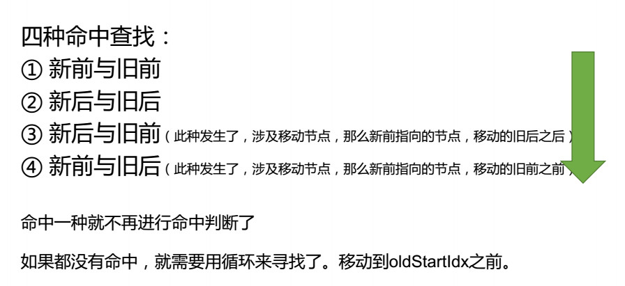
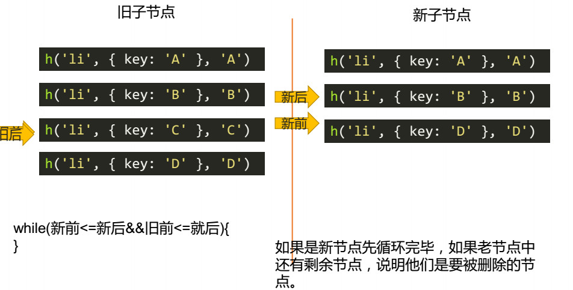
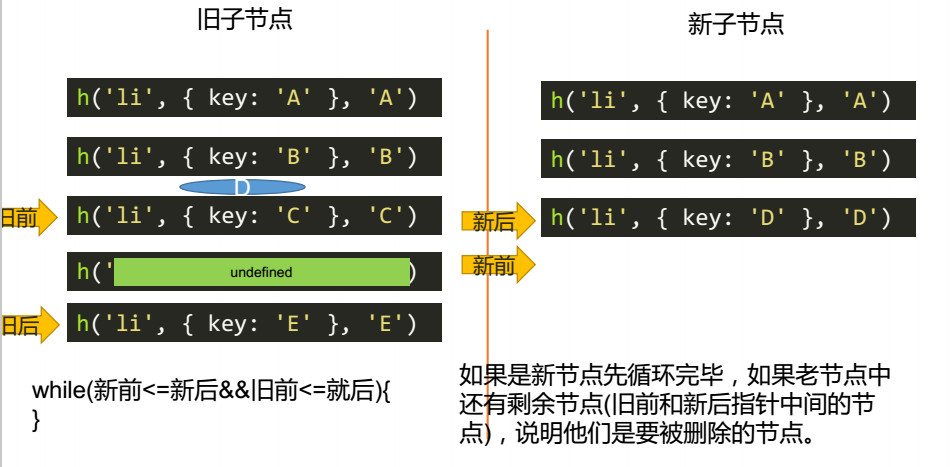
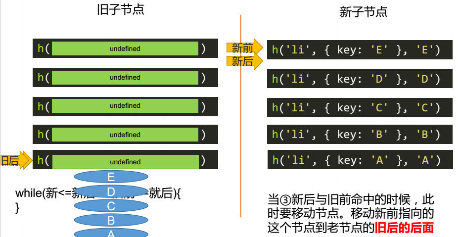

# 虚拟 DOM 与 diff 算法

## diff流程图


## 经典diff优化策略


### 新增情况


### 删除一个节点情况


### 删除多个节点情况


### 新前与旧后的情况


### 新后与旧前的情况



## vNode 函数

```javascript
/**
 * @param {*} sel 标签名
 * @param {*} data 数据
 * @param {*} children 子节点
 * @param {*} text 文本节点
 * @param {*} elm 渲染出来的真实DOM
 */
function vNode(sel, data, children, text, elm) {
  const key = data.key;
  return {
    sel,
    data,
    children,
    text,
    elm,
    key
  };
}
```

## isSameVnode 函数

```javascript
/**
 * @param {*} vnode1
 * @param {*} vnode2
 * 判断是否为相同的虚拟节点
 */
function isSameVnode(vnode1, vnode2) {
  return vnode1.sel === vnode2.sel && vnode2.key === vnode1.key;
}
```

## h 函数

```javascript
/**
 * @param {*} sel 标签名
 * @param {*} data 数据
 * @param {*} children 子节点，可以是数组,文本或者h函数
 * 调用情况
 * h('div',{},'你好')
 * h('div',{},[])
 * h('div',{},h())
 */
function h(sel, data, children) {
  if (typeof children === "string") {
    return vNode(sel, data, undefined, children, undefined);
  } else if (Array.isArray(children)) {
    const result = [];
    for (let i = 0; i < children.length; i++) {
      const child = children[i];
      if (child.sel) {
        result.push(child);
      }
    }
    return vNode(sel, data, result, undefined, undefined);
  } else if (children.sel) {
    return vNode(sel, data, [children], undefined, undefined);
  }
}
```

## createElement 函数

```javascript
/**
 * @param {*} vnode
 * 根据虚拟DOM生成真实DOM
 */
function createElement(vnode) {
  const domNode = document.createElement(vnode.sel);
  if (typeof vnode.text === "string") {
    // children是文本
    domNode.innerText = vnode.text;
  } else if (Array.isArray(vnode.children)) {
    // children是数组
    for (let i = 0; i < vnode.children.length; i++) {
      const child = vnode.children[i];
      const dom = createElement(child);
      child.elm = dom;
      domNode.appendChild(dom);
    }
  }
  vnode.elm = domNode;
  return vnode.elm;
}
```

## patch 函数

```javascript
/**
 * @param {*} oldVnode
 * @param {*} newVnode
 * 对比虚拟DOM
 */
function patch(oldVnode, newVnode) {
  // 第一次插入，需要把容器转化为vnode
  if (!oldVnode.sel) {
    oldVnode = vNode(
      oldVnode.tagName.toLowerCase(),
      {},
      undefined,
      undefined,
      oldVnode
    );
  }
  if (isSameVnode(oldVnode, newVnode)) {
    // 相同节点
    patchVnode(oldVnode, newVnode);
  } else {
    // 不相同，则暴力删除
    const dom = createElement(newVnode);
    const parent = oldVnode.elm.parentNode;
    parent.insertBefore(dom, oldVnode.elm);
    parent.removeChild(oldVnode.elm);
  }
}
```

## patchVnode 函数

```javascript
/**
 * @param {*} oldVnode
 * @param {*} newVnode
 * 对比虚拟DOM
 */
function patchVnode(oldVnode, newVnode) {
  // 相同节点
  if (oldVnode == newVnode) {
    return;
  }
  // 新vnode子节点是文本的情况
  if (typeof newVnode.text === "string") {
    if (newVnode.text !== oldVnode.text) {
      oldVnode.elm.innerText = newVnode.text;
    }
  } else {
    // 新vnode子节点是对象

    // 旧vnode子节点是文本的情况
    if (typeof oldVnode.text === "string") {
      // 清空子节点
      oldVnode.elm.innerHTML = "";
      // 新节点上树
      for (let i = 0; i < newVnode.children.length; i++) {
        const child = newVnode.children[i];
        const dom = createElement(child);
        oldVnode.elm.appendChild(dom);
      }
    } else {
      // 新旧vnode子节点都是对象
      updateChildren(oldVnode.elm, oldVnode.children, newVnode.children);
    }
  }
}
```

## updateChildren 函数

```javascript
/**
 * @param {*} parentElm 旧的真实DOM
 * @param {*} oldCh 旧的虚拟DOM子节点
 * @param {*} newCh 新的虚拟DOM子节点
 * 对比新旧节点都是数组的情况
 * 四种命中方式
 * ①新前与旧前
 * ②新后与旧后
 * ③新后与旧前
 * ④新前与旧后
 */
function updateChildren(parentElm, oldCh, newCh) {
  // 新前指针
  let newStartIdx = 0;
  // 新后指针
  let newEndIdx = newCh.length - 1;
  // 旧前指针
  let oldStartIdx = 0;
  // 旧后指针
  let oldEndIdx = oldCh.length - 1;
  // 新前虚拟DOM
  let newStartVnode = newCh[newStartIdx];
  // 新后虚拟DOM
  let newEndVnode = newCh[newEndIdx];
  // 旧前虚拟DOM
  let oldStartVnode = oldCh[oldStartIdx];
  // 旧后虚拟DOM
  let oldEndVnode = oldCh[oldEndIdx];
  // 缓存没有命中的节点，这样就可以不用多次遍历
  let keyMap = null;

  while (newStartIdx <= newEndIdx && oldStartIdx <= oldEndIdx) {
    // 要先忽略已经是undefined的东西
    if (newStartIdx === null || newCh[newStartIdx] === undefined) {
      newStartVnode = newCh[++newStartIdx];
    } else if (newEndIdx === null || newCh[newEndIdx] === undefined) {
      newEndVnode = newCh[--newEndIdx];
    } else if (oldStartIdx === null || oldCh[oldStartIdx] === undefined) {
      oldStartVnode = oldCh[++oldStartIdx];
    } else if (oldEndIdx === null || oldCh[oldEndIdx] === undefined) {
      oldEndVnode = oldCh[--oldEndIdx];
    } else if (isSameVnode(newStartVnode, oldStartVnode)) {
      // 新前与旧前
      patchVnode(oldStartVnode, newStartVnode);
      newStartVnode = newCh[++newStartIdx];
      oldStartVnode = oldCh[++oldStartIdx];
    } else if (isSameVnode(newEndVnode, oldEndVnode)) {
      // 新后与旧后
      patchVnode(oldEndVnode, newEndVnode);
      newEndVnode = newCh[--newEndIdx];
      oldEndVnode = oldCh[--oldEndIdx];
    } else if (isSameVnode(newEndVnode, oldStartVnode)) {
      // 新后与旧前
      patchVnode(oldStartVnode, newEndVnode);
      // 此时要移动节点，移动新前指向的这个节点到老节点的旧后的后面
      parentElm.insertBefore(oldStartVnode.elm, oldEndVnode.elm.nextSibling);
      newEndVnode = newCh[--newEndIdx];
      oldStartVnode = oldCh[++oldStartIdx];
    } else if (isSameVnode(newStartVnode, oldEndVnode)) {
      // 新前与旧后
      patchVnode(oldEndVnode, newStartVnode);
      // 此时要移动节点，移动新前指向的这个节点到老节点的旧前的前面
      parentElm.insertBefore(oldEndVnode.elm, oldStartVnode.elm);
      newStartVnode = newCh[++newStartIdx];
      oldEndVnode = oldCh[--oldEndIdx];
    } else {
      // 上面四种都没有命中
      if (!keyMap) {
        keyMap = {};
        // 缓存旧节点没有命中的
        for (let i = oldStartIdx; i <= oldEndIdx; i++) {
          const key = oldCh[i].key;
          if (key !== undefined) {
            keyMap[key] = i;
          }
        }
      }

      const oldIdx = keyMap[newStartVnode.key];
      if (oldIdx === null || oldIdx === undefined) {
        // 全新的，需要新增，即是新增的情况
        parentElm.insertBefore(createElement(newStartVnode), oldStartVnode.elm);
      } else {
        // 不是全新的，需要移动
        const elmToMove = oldCh[oldIdx];
        patchVnode(elmToMove, newStartVnode);
        oldCh[oldIdx] = undefined;
      }
      // 移动指针
      newStartVnode = newCh[++newStartIdx];
    }
  }

  if (newStartIdx <= newEndIdx) {
    // 旧节点先遍历完毕，新节点还有剩余，即使新增情况
    const before = newCh[newEndIdx + 1] ? newCh[newEndIdx + 1].elm : null;
    for (let i = newStartIdx; i <= newEndIdx; i++) {
      // insertBefore可自动识别null，为null是自动插入到末尾，跟appendChild一样
      if (oldStartVnode) {
        parentElm.insertBefore(createElement(newCh[i]), oldStartVnode.elm);
      } else {
        parentElm.insertBefore(createElement(newCh[i]), before);
      }
    }
  } else if (oldStartIdx <= oldEndIdx) {
    // 新节点先遍历完毕，旧节点还有剩余，即是删除的情况
    for (let i = oldStartIdx; i <= oldEndIdx; i++) {
      parentElm.removeChild(oldCh[i].elm);
    }
  }
}
```

## 使用

```javascript
const node = h("ul", {}, [
  h("li", { key: "A" }, "A"),
  h("li", { key: "B" }, "B"),
  h("li", { key: "C" }, "C"),
  h("li", { key: "D" }, "D")
]);
// const node = h('section', {}, [
//     h('p',{},'1'),
//     h('p',{},'2')
// ])
const container = document.getElementById("container");
// container.nextSibling
// container.parentNode.removeChild
// 第一次上树
patch(container, node);

const btn = document.getElementById("btn");

btn.addEventListener("click", function() {
  // const newNode = h('section',{},'好啊好啊')
  // const newNode = h('section',{},[
  //     h('h1',{},'我是新来的h1'),
  //     h('h2',{},'我是新来的h2')
  // ])
  const newNode = h("ul", {}, [
    h("li", { key: "E" }, "E"),
    h("li", { key: "A" }, "A"),
    h("li", { key: "B" }, "B"),
    h("li", { key: "F" }, "F"),
    h("li", { key: "C" }, "C"),
    h("li", { key: "D" }, "D"),
    h("li", { key: "G" }, "G")
  ]);

  patch(node, newNode);
});
```
