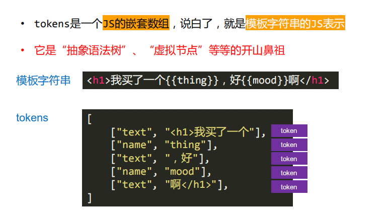
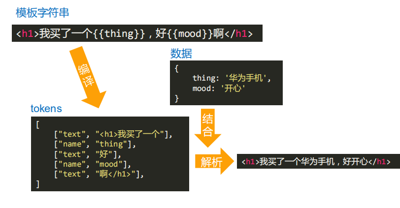
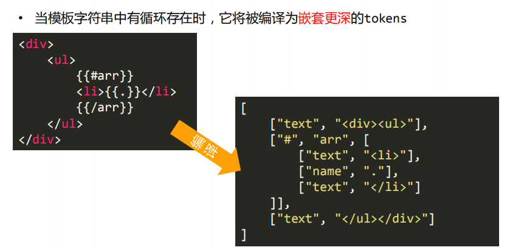
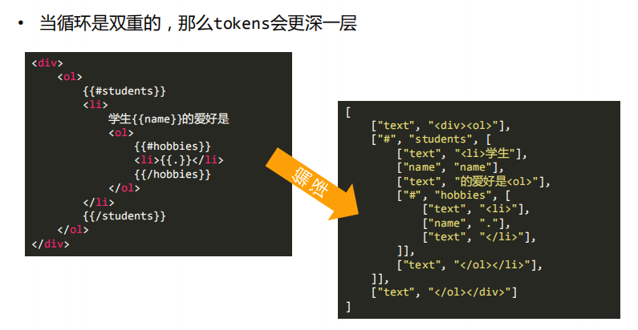
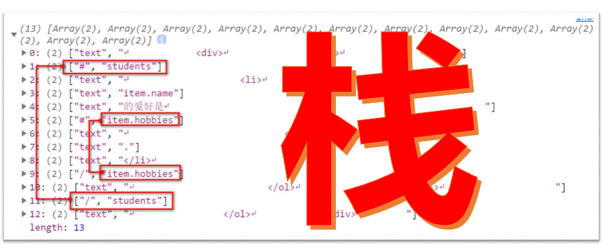

# mustache 模板引擎

## 模板转token图





## 扫描器

```javascript
class Scan {
  constructor(templateStr) {
    // 模板
    this.templateStr = templateStr;
    // 指针
    this.pos = 0;
    // 还没扫描的模板
    this.tail = templateStr;
  }
  // 跳过指定标识符
  scan(tag) {
    this.pos += tag.length;
    this.tail = this.tail.substring(tag.length);
  }
  // 扫描到指定停止标识符
  scanUtil(stopTag) {
    // 记录开始位置
    var orignPos = this.pos;
    while (this.tail.indexOf(stopTag) !== 0 && this.eos()) {
      // 指针向前移动
      this.pos++;
      // 修改还没扫描的模板
      this.tail = this.tail.substring(1);
    }
    // 返回指定条件的字符
    return this.templateStr.substring(orignPos, this.pos);
  }
  // 扫描是否结束
  eos() {
    return this.templateStr.length >= this.pos;
  }
}
```

## 将模板字符串转化为一维数组的 token

```javascript
function parseTemplateToToken(templateStr) {
  var scanInstance = new Scan(templateStr);
  var tokens = [];
  while (scanInstance.eos()) {
    // 获取 {{ 之前的文本
    var word1 = scanInstance.scanUtil("{{");
    // 让指针跳过 {{
    scanInstance.scan("{{");
    // 获取 {{ xxx }} 中的 xxx变量
    var word2 = scanInstance.scanUtil("}}");
    // 让指针跳过 }}
    scanInstance.scan("}}");
    if (word1 != "") {
      // 文本内容

      // 去空格
      var isjjh = false;
      var _word = "";
      for (var i = 0; i < word1.length; i++) {
        // 是否在标签里面,标签里面的空格是不能去掉的
        if (word1[i] === "<") {
          isjjh = true;
        } else if (word1[i] === ">") {
          isjjh = false;
        }
        if (!/\s/.test(word1[i])) {
          // 不是空格
          _word += word1[i];
        } else {
          if (isjjh) {
            // 是空格，但是在标签里面
            _word += word1[i];
          }
        }
      }
      tokens.push(["text", _word]);
    }
    if (word2 != "") {
      // 变量内容

      if (word2.indexOf("#") === 0) {
        // 数组开始
        tokens.push(["#", word2.substring(1)]);
      } else if (word2.indexOf("/") === 0) {
        // 数组结束
        tokens.push(["/", word2.substring(1)]);
      } else {
        // 普通变量
        tokens.push(["name", word2]);
      }
    }
  }
  return tokens;
}
```

## 折叠 token




```javascript
// 将一位数组折叠成嵌套数组，利用栈的思想和引用值类型特征

/**
 * ①遇见 # 就进栈，并且将收集器指向他的儿子
 * ②遇见 / 就出栈，并且将收集器指向栈顶的儿子，如果栈中没有元素，则指会原数组
 * ③其余的往收集器中push就行了
 */
function nestToken(tokens) {
  // 创建一个新数组
  var newtokens = [];
  // 收集器默认指向新数组
  var collector = newtokens;
  //   栈
  var stack = [];
  for (let i = 0; i < tokens.length; i++) {
    var token = tokens[i];
    switch (token[0]) {
      case "#":
        collector.push(token);
        stack.push(token);
        collector = token[2] = [];
        break;
      case "/":
        stack.pop();
        collector = stack.length > 0 ? stack[stack.length - 1][2] : newtokens;
        break;
      default:
        collector.push(token);
    }
  }
  return newtokens;
}
```

## 渲染模板字符串

```javascript
// 获取 a.b.c字符串的值
function lookup(data, keyStr) {
  var arr = keyStr.split(".").filter(Boolean);
  if (arr.length === 0) {
    return data[keyStr];
  }
  var tempObj = data;
  for (var i = 0; i < arr.length; i++) {
    tempObj = tempObj[arr[i]];
  }
  return tempObj;
}

function parseArray(token, data) {
  // 获取数组的值
  var dataArr = data[token[1]];
  var resultStr = "";
  for (var i = 0; i < dataArr.length; i++) {
    resultStr += renderTemplate(token[2], {
      ...dataArr[i],
      ".": dataArr[i],
    });
  }
  return resultStr;
}
// 渲染模板字符串
function renderTemplate(tokens, data) {
  var domstr = "";
  for (var i = 0; i < tokens.length; i++) {
    var token = tokens[i];
    if (token[0] === "text") {
      // 文本类型的直接拼接上去
      domstr += token[1];
    } else if (token[0] === "name") {
      // 普通变量则获取其值，在拼接上去
      domstr += lookup(data, token[1]);
    } else if (token[0] === "#") {
      // 数组变量
      domstr += parseArray(token, data);
    }
  }
  return domstr;
}
```

## 使用

```javascript
var TemplateEngine = {
  render: function(templateStr, data) {
    // 将模板字符串变成一维token
    var tokens = parseTemplateToToken(templateStr);
    // 折叠token
    var tokens1 = nestToken(tokens);
    // 渲染模板字符串
    var domstr = renderTemplate(tokens1, data);
    console.log(domstr);
    return domstr;
  },
};

// var templateStr = `我爱{{somebody}},{{somebody}}也爱我,好{{mode}}啊`
var templateStr = `
    <div>{{classname}}</div>
    <ul>
        {{#student}}
        <li class='list'>{{name}}</li>
        <li>
            <ol>
                {{#hobby}}
                <li>
                    {{.}}
                </li>
                {{/hobby}}
            </ol>
            
        </li>
        {{/student}}
    </ul>
    `;
var data = {
  classname: "小学一班",
  student: [
    { name: "小明", hobby: ["篮球", "排球"] },
    { name: "李四", hobby: ["唱歌", "跳舞"] },
  ],
};
// var data = {
//     somebody:'小明',
//     mode:'好心情'
// }
var domStr = TemplateEngine.render(templateStr, data);
document.getElementById("container").innerHTML = domStr;
```
